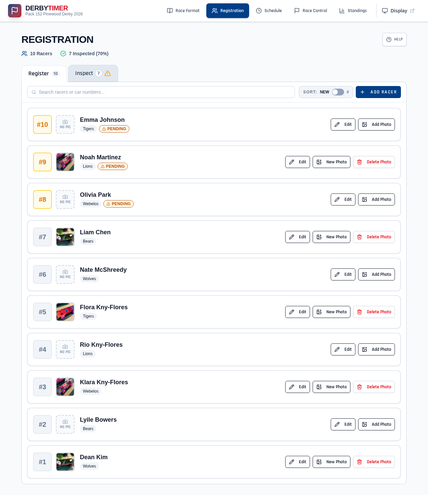
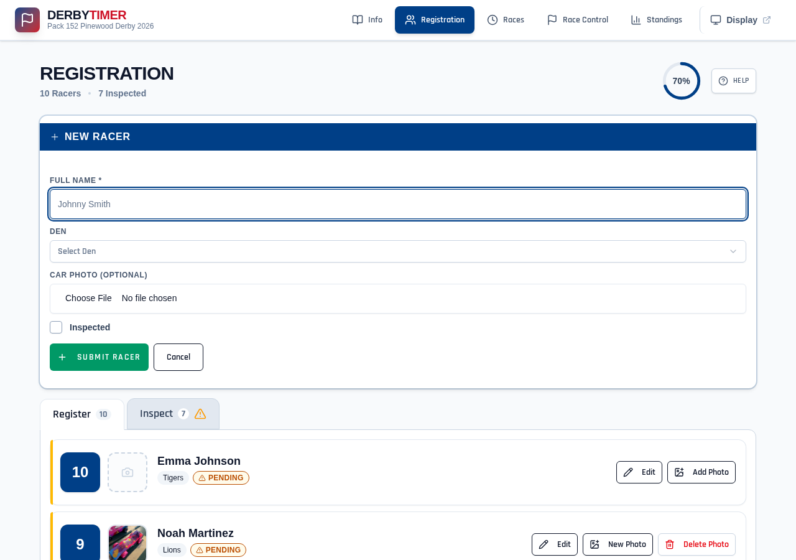
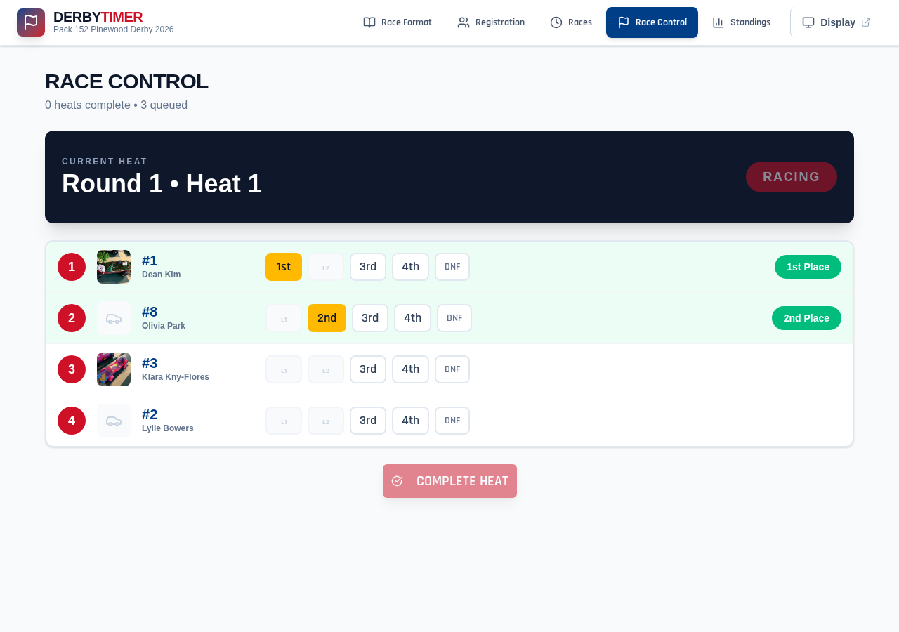
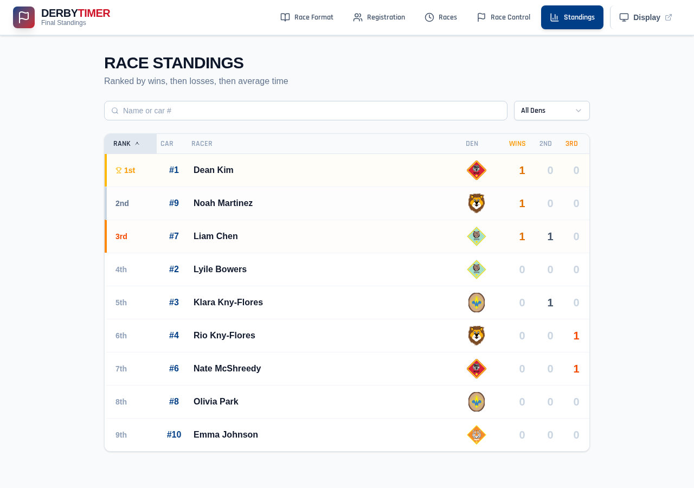
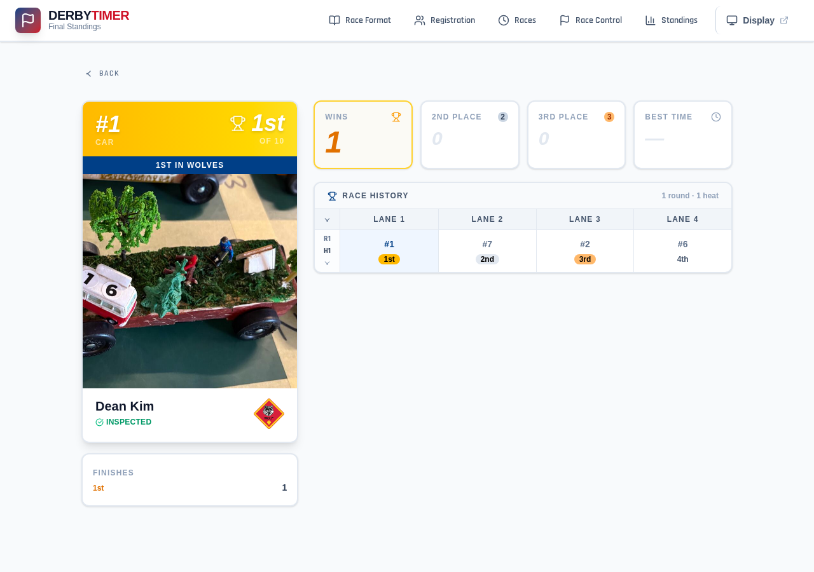
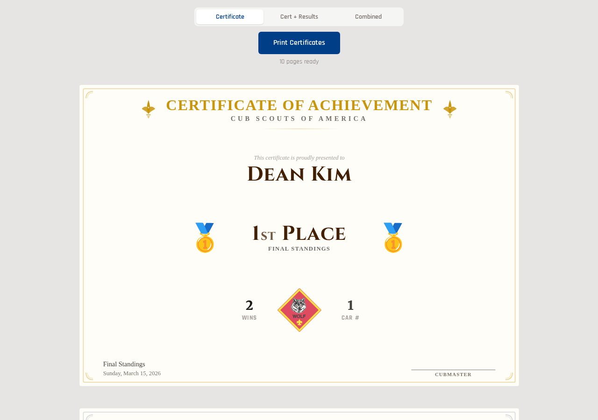

# DerbyTimer

> A turnkey Pinewood Derby race management system that any pack volunteer can set up, run, and tear down in under an hour — no internet required.

Built with Bun, SQLite, and React. One laptop, one network, zero cloud dependencies. 

See [plans](docs/plans/) for the long-term vision — cloud deployment, hardware timer integration, and more.

## Screenshots

<table>
<tr>
<td><a href="screenshots/01-registration-list.png"></a></td>
<td><a href="screenshots/02-registration-form.png"></a></td>
</tr>
<tr>
<td><a href="screenshots/09-race-control-running.png"></a></td>
<td><a href="screenshots/10-standings.png"></a></td>
</tr>
<tr>
<td><a href="screenshots/12-racer-profile-with-photo.png"></a></td>
<td><a href="screenshots/14-certificate.png"></a></td>
</tr>
</table>

<sub><a href="https://github.com/pack152berlin/derby-timer/tree/main/screenshots">See all screenshots</a></sub>

## Features

- **Event Management** — Create and manage race day events
- **Racer Registration** — Add racers with den/rank, car numbers, and photos
- **Inspection Tracking** — Pass/fail weight inspection workflow
- **Heat Generation** — Balanced lane rotation algorithm (every racer runs every lane)
- **Live Race Console** — Record finish order with one click per lane
- **Standings** — Auto-calculated rankings: Wins → Losses → Avg Time
- **Racer Profiles** — Per-racer stats, heat history, timing breakdown
- **Projection Display** — Full-screen view optimised for wall projectors

## Requirements

- [Bun](https://bun.com) v1.2+
- Modern web browser

## Quick Start

```bash
bun install
bun start          # Runs migrations automatically, starts server with hot reload
# Open http://localhost:3000
```

## Dev Scripts

### Seed the Database

Populate the database with realistic test data. Both scripts create a specifyable number of racers with random Cub Scout names, dens, and car photos (roughly 80% get photos). Event names and dates are randomised so the scripts can be run multiple times.

```bash
# Mid-race: 2 rounds completed, remaining rounds pending
bun run seed:mid-race

# Completed race: all rounds finished, final standings available
bun run seed:complete
```

**Options** (both scripts):

| Flag | Default | Description |
|------|---------|-------------|
| `--lanes N` | `4` | Number of track lanes |
| `--rounds N` | `3` | Total rounds to generate |
| `--cars N` | `40` | Number of racers to create |
| `--times` | off | Include realistic race times in results |
| `--db PATH` | `derby.db` | Database file to seed into |
| `--port N` | `3101`/`3102` | Temp server port (avoids conflicts) |

```bash
# 4-lane race, no times
bun run seed:mid-race --lanes 4

# 8-lane race with timing data
bun run seed:complete --lanes 8 --times

# Custom database file
bun run seed:mid-race --db my-test.db
```

### Clear the Database

```bash
bun run clear:derbies    # Delete all events (keeps DB file and schema)
```

To fully reset: delete `derby.db` — migrations run automatically on next start.

### Race-Day Rehearsal

End-to-end integration test: spins up an isolated server, creates an event, runs a full race including a mid-heat server restart, then verifies results and cleans up.

```bash
bun run rehearsal:race-day

# Options
bun run rehearsal:race-day --cars 50 --lanes 4 --rounds 2 --keep-db
```

## Testing

```bash
bun run test:all              # All tests (unit + integration + UI)
bun test                      # Unit + integration tests
bun run test:unit             # Unit tests only
bun run test:integration:api  # API + WebSocket tests (public mode, :3099)
bun run test:integration:auth # Auth integration tests (admin + viewer keys, :3098)
bun run test:ui               # Playwright E2E tests
bun run screenshots           # Capture UI screenshots with Playwright
```

## Authentication

DerbyTimer supports three auth modes controlled by environment variables. **By default (no keys set), everything is open** — the race-day default for local networks with zero setup friction.

### Auth Modes

| `DERBY_ADMIN_KEY` | `DERBY_VIEWER_KEY` | Mode |
|---|---|---|
| Not set | Not set | **Public** — full access, no auth (race-day default) |
| Set | Not set | **Admin-protected** — reads are public, mutations require admin login |
| Set | Set | **Fully private** — both viewing and admin require passwords |

### Environment Variables

| Variable | Description |
|---|---|
| `DERBY_ADMIN_KEY` | Admin password. Set to `auto` to generate a random key on first run (saved next to DB). |
| `DERBY_VIEWER_KEY` | Viewer password. When set, all pages require authentication. |

### Developing with Auth

```bash
# Test admin-protected mode
DERBY_ADMIN_KEY=secret bun start
# Then POST to /admin/login with { "password": "secret" }

# Test fully private mode
DERBY_ADMIN_KEY=secret DERBY_VIEWER_KEY=viewer bun start
# All pages require login. Use /admin/login or /viewer/login.

# Auto-generated admin key (persisted to .derby_admin_key file)
DERBY_ADMIN_KEY=auto bun start
```

## Race Day Workflow

### 1. Event Setup
1. Open the home page and click **Create Event**
2. Enter event name, date, and lane count

### 2. Registration
1. Click **Registration** in the nav
2. Add racers — name, den, optional photo upload
3. Run inspection and mark cars as passed

### 3. Generate Heats
1. Click **Schedule** in the nav
2. Click **Generate Heats** — balanced lane assignments are created automatically

### 4. Racing
1. Open **Race Control** for the operator console
2. Open **Display** in a new tab and project it on the wall
3. For each heat:
   - Click **START HEAT**
   - Cars race; record finish order (1st–Nth or DNF)
   - Click **Complete Heat & Save**
4. System advances to the next heat automatically

### 5. Awards
1. Click **Standings** to see final rankings
2. Rankings: Wins → Losses → Avg Time
3. Top 3 highlighted with gold / silver / bronze styling

## API Reference

### Events
| Method | Path | Description |
|--------|------|-------------|
| `GET` | `/api/events` | List all events |
| `POST` | `/api/events` | Create event (`name`, `date`, `lane_count`) |
| `GET` | `/api/events/:id` | Get event |
| `PATCH` | `/api/events/:id` | Update event |
| `DELETE` | `/api/events/:id` | Delete event (only if no racers) |

### Racers
| Method | Path | Description |
|--------|------|-------------|
| `GET` | `/api/events/:id/racers` | List racers for event |
| `POST` | `/api/events/:id/racers` | Add racer (`name`, `den`) |
| `GET` | `/api/racers/:id` | Get racer |
| `PATCH` | `/api/racers/:id` | Update racer |
| `DELETE` | `/api/racers/:id` | Delete racer |
| `GET` | `/api/racers/:id/photo` | Download car photo |
| `POST` | `/api/racers/:id/photo` | Upload car photo (multipart) |
| `DELETE` | `/api/racers/:id/photo` | Remove car photo |
| `POST` | `/api/racers/:id/inspect` | Mark inspection pass/fail |
| `GET` | `/api/racers/:id/history` | Racer's full heat history |

### Heats
| Method | Path | Description |
|--------|------|-------------|
| `GET` | `/api/events/:id/heats` | List heats with lane assignments and results |
| `POST` | `/api/events/:id/generate-heats` | Auto-generate balanced heats (`rounds`, `lane_count`) |
| `DELETE` | `/api/events/:id/heats` | Clear all heats |
| `GET` | `/api/heats/:id` | Get heat with lanes |
| `POST` | `/api/heats/:id/start` | Start heat |
| `POST` | `/api/heats/:id/complete` | Complete heat |
| `POST` | `/api/heats/:id/results` | Record batch results |
| `GET` | `/api/heats/:id/results` | Get results for heat |

### Standings
| Method | Path | Description |
|--------|------|-------------|
| `GET` | `/api/events/:id/standings` | Get race rankings |

### Live Console
| Method | Path | Description |
|--------|------|-------------|
| `GET` | `/api/race/active` | Current running heat + elapsed time |
| `POST` | `/api/race/stop` | Stop running heat |

## Database Schema

SQLite database via `bun:sqlite`. Migrations run automatically on startup.

| Table | Description |
|-------|-------------|
| `events` | Race day events (name, date, lane count, status) |
| `racers` | Scout racers with den, car number, inspection status, photo |
| `heats` | Race heats (round, heat number, status, timestamps) |
| `heat_lanes` | Lane assignments per heat |
| `results` | Finish results (place, optional time, DNF flag) |
| `standings` | Materialised win/loss stats, recalculated after each heat |
| `event_planning_settings` | Heat generation parameters per event |
| `round_racer_rosters` | Racer participation per round |

**Scoring**: 1st place = win; 2nd–Nth and DNF = loss. Rankings: Wins DESC, Losses ASC, Avg Time ASC.

## UI Views

| Route | Description |
|-------|-------------|
| `/` | Event selector and creation |
| `/register` | Racer registration with photo upload and inspection |
| `/heats` | Heat schedule preview and generation controls |
| `/race` | Live race console (operator) |
| `/standings` | Rankings with win/loss and timing |
| `/format` | Race format configuration |
| `/display` | Full-screen projection view (auto-rotates through standings, current heat) |

Individual racer profiles are accessible from the Standings and Registration views.

## Architecture

```
derby-timer/
├── src/
│   ├── index.ts               # Bun server, all API routes, WebSocket
│   ├── auth.ts                # Authentication module (HMAC cookies, middleware)
│   ├── migrate.ts             # Standalone migration runner
│   ├── db/
│   │   ├── connection.ts      # SQLite singleton
│   │   ├── umzug.ts           # Migration setup
│   │   ├── migrations/        # Schema migrations (001–003)
│   │   └── models/            # Repository classes (events, racers, heats, results)
│   ├── race/
│   │   └── heat-planner.ts    # Balanced lane rotation algorithm
│   ├── electronics/           # Serial port integration for timing hardware
│   └── frontend/              # React SPA
│       ├── main.tsx           # App shell + navigation
│       ├── views/             # Page components
│       └── components/        # Shared UI components (shadcn/ui)
├── scripts/
│   ├── seed-mid-race.ts       # Dev: 40 racers, 2 rounds complete
│   ├── seed-complete.ts       # Dev: 40 racers, all rounds complete
│   ├── clear-derbies.ts       # Dev: wipe all events
│   └── race-day-rehearsal.ts  # CI: full end-to-end race simulation
├── tests/                     # Unit + integration tests
└── e2e/                       # Playwright tests
```

## Heat Generation Algorithm

1. **Every racer runs every lane** when `racers × rounds` allows it
2. **Even pairing** — minimises how often the same two racers compete
3. **Performance balancing** — in later rounds, racers with similar records are paired
4. **Lookahead** — plans 2–3 heats ahead to improve fairness

## Tech Stack

- **Runtime**: Bun (TypeScript, built-in bundler + SQLite)
- **Database**: SQLite via `bun:sqlite` + Umzug migrations
- **Frontend**: React 19 + Tailwind CSS v4 + shadcn/ui
- **Server**: `Bun.serve()` with hot reload and WebSocket broadcast
- **Testing**: Bun test runner + Playwright

## Roadmap

See [Project Vision](docs/vision.md) for the full roadmap — real-time WebSocket display, hardware timer integration, Raspberry Pi deployment, setup wizard, cloud sync, and more.

---

Built for fast-paced Pinewood Derby race days.
